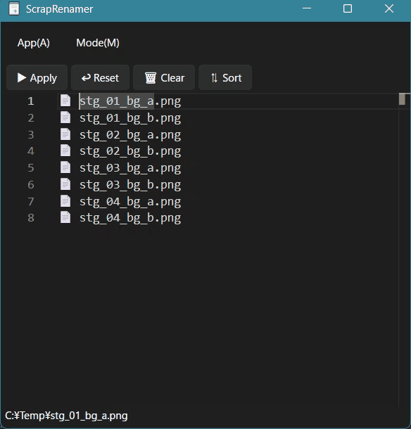

[English](README.md) | 日本語

# ScrapRenamer

テキストエディター型のファイルリネームツールです。

ファイルをドラッグアンドドロップ後、ファイル名一覧をテキストエディター感覚で編集できます。  
実行ボタン(or Ctrl+S)で一括リネームを実行します。

エディター部分は [VS Code](https://github.com/microsoft/vscode) と同じ [Monaco Editor](https://github.com/microsoft/monaco-editor) を採用しています。

## 主な機能

- 編集したリネーム内容の適用 (Ctrl+S)
- 検索・置換 (Ctrl+H)
- 複数カーソル編集
  - カーソルを上に追加 (Ctrl+Alt+Up)
  - カーソルを下に追加 (Ctrl+Alt+Down)
- 文字種の変換 (Ctrl+Shift+P)
  - 大文字 (UPPERCASE)
  - 小文字 (lowercase)
  - キャメルケース (camelCase)
  - スネークケース (snake_case)
  - パスカルケース (PascalCase)

## 実行までの手順

* https://github.com/osakana4242/scrap-renamer/releases/latest から最新版の zip をダウンロードする
* zip を好みの場所に展開する
* `ScrapRenamer.exe` を実行します。
* 「Windows によって PC が保護されました」と表示された場合は、
「詳細情報」→「実行」を選択します。

## ライセンス

このソフトウェア本体は 0BSD ライセンスです。

作者へのクレジット表記なしで、自由に使用・改変・再配布できます。

詳細は [LICENSE.txt](./LICENSE.txt) を参照してください。
