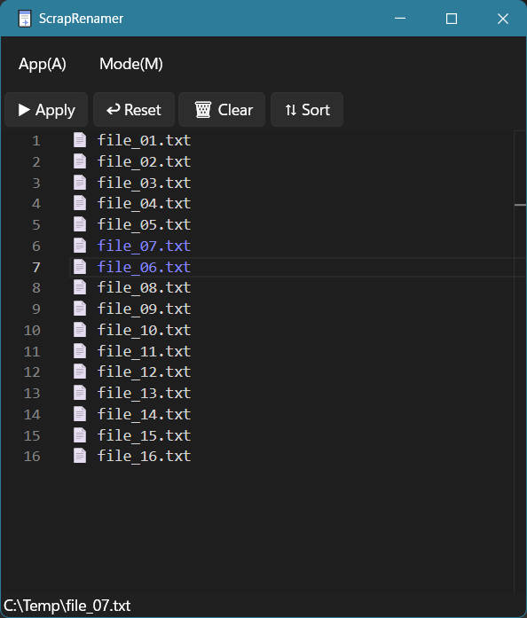

English | [日本語](README.ja.md)

# ScrapRenamer

A text editor-style file renaming tool.

After dragging and dropping files, you can edit the list of filenames just like in a text editor.  
Click the Execute button (or press Ctrl+Enter) to rename all files at once.

The editor is powered by the same [Monaco Editor](https://github.com/microsoft/monaco-editor) used by [VS Code](https://github.com/microsoft/vscode).

## Features

- Multi-cursor editing
- Column (rectangular) selection
- Search and replace
- File name swapping

## License

This software is licensed under the 0BSD License.

You are free to use, modify, and redistribute it without crediting the author.

See [LICENSE.txt](./LICENSE.txt) for details.
